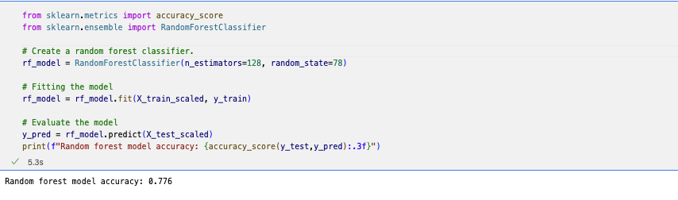

# Neural Network Charity Analysis

## Overview of the analysis:

With knowledge of machine learning and neural networks, I’ll use the features in the provided dataset to help create a binary classifier that is capable of predicting whether applicants will be successful if funded by Alphabet Soup.

From Alphabet Soup’s business team, we received a CSV containing more than 34,000 organizations that have received funding from Alphabet Soup over the years. Within this dataset are a number of columns that capture metadata about each organization, such as the following:

EIN and NAME—Identification columns
APPLICATION_TYPE—Alphabet Soup application type
AFFILIATION—Affiliated sector of industry
CLASSIFICATION—Government organization classification
USE_CASE—Use case for funding
ORGANIZATION—Organization type
STATUS—Active status
INCOME_AMT—Income classification
SPECIAL_CONSIDERATIONS—Special consideration for application
ASK_AMT—Funding amount requested
IS_SUCCESSFUL—Was the money used effectively

## Purpose

A foundation, Alphabet Soup, wants to predict where to make investments. The goal is to use machine learning and neural networks to apply features on a provided dataset to create a binary classifier that is capable of predicting whether applicants will be successful if funded by Alphabet Soup. The initial file has 34,000 organizations and a number of columns that capture metadata about each organization from past successful fundings.

## Results:

### Data Preprocessing

The questions we have to answer looking at our data are the following:

- What variable(s) are considered the target(s) for our model?
The target of the model (X) is the column "IS_SUCCESSFUL" indicating that it has been successfully funded by AlphabetSoup.
- What variable(s) are considered to be the features for your model?
The features of the model (y) going to be all columns of the DataFrame except target column, which is IS_SUCCESSFUL.
The code will be the following:

- What variable(s) are neither targets nor features, and should be removed from the input data?
The EIN and NAME columns will not affect the accuracy of the model and can be removed to improve code efficiency.

### Compiling, Training, and Evaluating the Model

- How many neurons, layers, and activation functions did you select for your neural network model, and why?
In the optimized model, layer 1 started with 100 neurons with a relu activation. For layer 2, it dropped to 30 neurons and a sigmoid activation. From there, the sigmoid activation seemed to be the better fit for layer 3 (10 neurons). Because when I ran code with other parametrs accuracy score was lower.
- Were you able to achieve the target model performance?
The target for the model was 75%, but the best the model could produce was 53.3%.
- What steps did you take to try and increase model performance?
I tried to use a different model to see if it will do predictions better and a RandomForestClassifier seems showing a better results of accuracy score as 77,6%.

## Summary:
The relu and sigmoid activations yielded a low accuracy, which is the best the neural network model could produce using various number of neurons and layers. And RandomForestClassifier could solve this problem, maybe the dataset wasn't big enough for neural networks or the model itself works better with this types of problem, it would need a deeper research and study.

